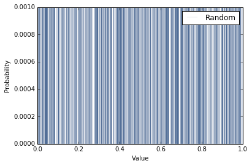
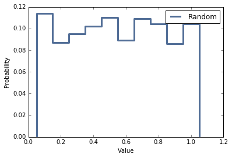
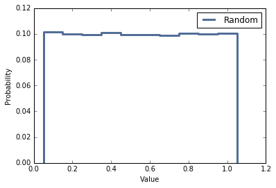
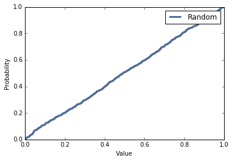

[Think Stats Chapter 4 Exercise 2](http://greenteapress.com/thinkstats2/html/thinkstats2005.html#toc41) (a random distribution)

>> **Exercise 4.2** The numbers generated by random.random are supposed to be uniform between 0 and 1; that is, every value in the range should have the same probability.  
Generate 1000 numbers from random.random and plot their PMF and CDF. Is the distribution uniform?

**Solution**

The exercise asks to verify that the numbers generated by `random.random` are uniformly distributed by examining the PDF & CDF.

```python
# Import Relevant Libraries
import random
random.seed(0)
import thinkstats2
import thinkplot
%matplotlib inline
import math

# Create Data: 1000 Numbers Generated by random.random
data = [random.random() for i in range(1000)]

# Preview Data
data[0:5]
```
    [0.8444218515250481,
     0.7579544029403025,
     0.420571580830845,
     0.25891675029296335,
     0.5112747213686085]

```python
# Create a Probability Mass Function
pmf = thinkstats2.Pmf(data)
thinkplot.Pmf(pmf,label='Random',linewidth=0.1)
thinkplot.Config(xlabel='Value',ylabel='Probability')
thinkplot.Show()
```



The above plot has no practical value since there are so many discrete values. The problem can be mitigated by binning the data into intervals or viewing the Cumulative Distribution Function. The following poses a possible solution to the problem by binning the data into ten equal intervals:

```python
# Bin Data into 10 Categories
def bin(data):
    bins = [0.1, 0.2, 0.3, 0.4, 0.5, 0.6, 0.7, 0.8, 0.9, 1.0]
    count = {}
    for num in data:
        temp = math.ceil(num*10)/10
        count[temp] = count.get(temp, 0) + 1
    return count
data_bin = bin(data)
data_bin
```
    {0.1: 114,
     0.2: 87,
     0.3: 95,
     0.4: 102,
     0.5: 110,
     0.6: 89,
     0.7: 109,
     0.8: 104,
     0.9: 86,
     1.0: 104}

```python
# Recreate Probability Mass Function with Binned Data
pmf = thinkstats2.Pmf(data_bin)
thinkplot.Pmf(pmf,label='Random')
thinkplot.Config(xlabel='Value',ylabel='Probability')
thinkplot.Show()
```



The plot above shows a better representation of the distribution. The plot illustrates that all ten intervals all occur with an estimate probability of 0.10 as expected and thus, can conclude that the distribution is uniform. By taking more data points, the probability of each interval will converge to 0.10 as shown by the following:


```python
# Create Data: 100000 Numbers Generated by random.random
more_data = [random.random() for i in range(100000)]

# Bin Data into 10 Categories:
data_bin = bin(more_data)

# Recreate Probability Mass Function with Binned Data
pmf = thinkstats2.Pmf(data_bin)
thinkplot.Pmf(pmf,label='Random')
thinkplot.Config(xlabel='Value',ylabel='Probability')
thinkplot.Show()
```



The other method of verifying whether a distribution is uniform is examining the Cumulative Distribution Function. By using the CDF, the data no longer has to be separated into bins.

```python
# Create a Cumulative Distribution Function
cdf = thinkstats2.Cdf(data)
thinkplot.Cdf(cdf,label='Random')
thinkplot.Config(xlabel='Value',ylabel='Probability')
thinkplot.Show()
```



The figure above illustrates that the CDF is linear, thus proving that the distribution is indeed uniform.
